# SnowbirdHQ Codebase Analysis

> Generated: 2026-02-16

---

## 1. Project Overview

**SnowbirdHQ** is a marketing website for Snowbird HQ Property Management, a luxury short-term rental management company based in Queenstown, New Zealand. The site serves as the public-facing landing page, legal documentation host, and guest welcome message platform.

**Tech Stack**: Next.js 16.1.1 (App Router), React 19.2.3, TypeScript 5, Tailwind CSS 3.4.14
**Architecture**: Static site with server-side rendering via Next.js App Router — all pages pre-rendered at build time
**Current State**: Production-ready, deployed at https://snowbirdhq.com via Vercel with automatic GitHub CI/CD

---

## 2. Folder Structure

```
snowbirdhq/
├── src/
│   └── app/                          # Next.js App Router pages
│       ├── layout.tsx                # Root layout with SEO metadata
│       ├── page.tsx                  # Homepage / landing page
│       ├── globals.css               # Tailwind imports + global styles
│       ├── icon.tsx                  # Dynamic favicon generator (edge runtime)
│       ├── privacy-policy/
│       │   └── page.tsx              # Privacy policy (12 sections)
│       ├── terms/
│       │   └── page.tsx              # Terms of service (17 sections)
│       └── guestmessage/
│           └── 25-dublin/
│               └── page.tsx          # Guest welcome page for 25 Dublin St property
├── public/                           # Static assets served at root
│   ├── SnowbirdHQ-trans.png          # Transparent logo (1.5MB)
│   ├── SnowbirdHQ.png               # Logo with background (1.4MB)
│   ├── snowbird.png                  # Alternative logo (1.4MB)
│   ├── queenstown-bg.jpg            # Background image for guest pages (527KB)
│   └── favicon.ico                   # Fallback favicon (649B)
├── reference docs/                   # Historical strategy/requirements docs (not active code)
├── .vercel/                          # Vercel project metadata
│   └── project.json                  # Project ID: prj_n4lc90DMguGdRww3DxB6y8p9SLSN
├── .playwright-mcp/                  # Playwright MCP artifacts
├── next.config.js                    # Next.js config (security headers, image optimization)
├── tailwind.config.js                # Tailwind theme (Snowbird brand colors)
├── tsconfig.json                     # TypeScript strict mode config
├── postcss.config.js                 # PostCSS with Tailwind + Autoprefixer
├── .eslintrc.json                    # ESLint (next/core-web-vitals + typescript)
├── .env.local.example                # Environment variable template
├── .mcp.json                         # MCP server config (Playwright)
├── package.json                      # Dependencies and scripts
├── CLAUDE.md                         # Project-specific Claude Code instructions
├── DEPLOYMENT_STATUS.md              # Build verification and deployment notes
├── deploy.md                         # Deployment troubleshooting guide
└── README.md                         # Quick-start documentation
```

**Notable decisions**: No `src/components/` directory — all UI is inline in page files. No `src/lib/` or `src/utils/` — no shared logic. The `reference docs/` directory contains historical planning documents that are not part of the application.

---

## 3. Entry Points & Execution Flow

### Primary Entry Point
- **File**: `src/app/layout.tsx` — Root layout wrapping all pages
- **Renders**: HTML skeleton with `<head>` metadata, global styles, and `{children}` slot

### Initialization Sequence
1. Next.js App Router matches the URL to a route under `src/app/`
2. Root layout (`layout.tsx`) applies: SEO metadata, viewport config, favicon link, global CSS
3. Page component renders static content (no data fetching, no API calls)
4. Next.js Image component handles lazy-loading and format conversion (WebP/AVIF)
5. Security headers injected by `next.config.js` on every response

### Request Handling
All pages are **statically generated** at build time. There is no dynamic server logic, no middleware, no API routes, and no database queries. Client-side interactivity is limited to HTML anchor links (`#services`, `#about`, `#contact`) and `mailto:`/`tel:` protocols.

### Shutdown/Cleanup
Not applicable — purely static site with no persistent connections or processes.

---

## 4. Core Modules & Components

### Homepage (`src/app/page.tsx`)
- **Purpose**: Main marketing landing page with 6 sections
- **Key sections**: Navigation header, Hero (brand + tagline), Services (6 cards in grid), About, Contact, Footer
- **Internal dependencies**: Root layout, globals.css, Tailwind config
- **Data**: All content hardcoded in JSX — business info, service descriptions, contact details

### Root Layout (`src/app/layout.tsx`)
- **Purpose**: SEO metadata, viewport config, HTML structure wrapper
- **Key exports**: `metadata` (Next.js Metadata object), `viewport` (Next.js Viewport object), default `RootLayout` component
- **Data**: Title, description, keywords, OpenGraph tags, Twitter card config, canonical URL

### Dynamic Favicon (`src/app/icon.tsx`)
- **Purpose**: Generates 32x32 PNG favicon at runtime using SVG bird illustration
- **Runtime**: Edge (via `next/og` ImageResponse API)
- **Key export**: `size`, `contentType`, default image generation function

### Guest Message Page (`src/app/guestmessage/25-dublin/page.tsx`)
- **Purpose**: Personalized guest welcome page for the 25 Dublin Street property
- **Design**: Full-screen Queenstown background with glass-morphism card overlay
- **Data**: Guest name, stay duration, origin, property details — all hardcoded, updated via git commits

### Legal Pages (`src/app/privacy-policy/page.tsx`, `src/app/terms/page.tsx`)
- **Purpose**: Privacy Policy (12 sections) and Terms of Service (17 sections)
- **Key details**: NZ Privacy Act 2020 compliance, GST 144-466-837, NZBN 9429052471889, BCampX Limited trading as Snowbird HQ
- **Effective date**: January 1, 2025

---

## 5. Data Models & State Management

### Data Models
**None.** The application has no custom TypeScript interfaces, types, schemas, or data models beyond React/Next.js defaults. All content is hardcoded in JSX.

### State Management
**None.** No React state, no context providers, no stores. The site is entirely stateless — every page is pure static HTML/CSS.

### Data Validation
**None.** No validation libraries (Zod, Yup, Joi) are used. There are no forms or user input fields.

### Migrations/Seeding
**Not applicable.** No database.

---

## 6. API & External Integrations

### Resend Email Service (Planned, Not Implemented)

| Field | Value |
|-------|-------|
| **Service** | Resend (resend.com) |
| **Purpose** | Contact form emails |
| **Auth** | API key (`RESEND_API_KEY`) |
| **Status** | Configured in `.env.local.example`, **no code implementation** |
| **Where configured** | `.env.local.example` |

### Next.js Image Optimization (Built-in)

| Field | Value |
|-------|-------|
| **Service** | Next.js built-in image optimization |
| **Purpose** | Automatic WebP/AVIF conversion, lazy loading |
| **Where configured** | `next.config.js` (`images.formats`) |

No other external integrations — no analytics, no payment processing, no CMS, no database services, no Hostaway API calls from this project.

---

## 7. Internal APIs / Exposed Endpoints

**None.** The project has no `src/app/api/` directory and exposes zero API endpoints. All routes serve static HTML pages:

| Method | Route | Purpose |
|--------|-------|---------|
| GET | `/` | Homepage / landing page |
| GET | `/privacy-policy` | Privacy policy |
| GET | `/terms` | Terms of service |
| GET | `/guestmessage/25-dublin` | Guest welcome message |
| GET | `/icon` | Dynamic favicon (edge runtime) |

---

## 8. Configuration & Environment

### Environment Variables

| Variable | Purpose | Required | Default | Used In Code |
|----------|---------|----------|---------|-------------|
| `RESEND_API_KEY` | Resend email service API key | Optional | None | **Not yet used** |

### Configuration Files

| File | Role |
|------|------|
| `next.config.js` | Security headers, image optimization formats |
| `tailwind.config.js` | Brand colors, font stack, letter spacing |
| `tsconfig.json` | TypeScript strict mode, path aliases (`@/*` → `./src/*`) |
| `postcss.config.js` | Tailwind CSS + Autoprefixer processing |
| `.eslintrc.json` | Linting rules (next/core-web-vitals, typescript) |
| `.mcp.json` | MCP server config for Playwright automation |
| `.vercel/project.json` | Vercel project and org IDs |

### Secrets Management
Environment variables stored in `.env.local` (gitignored). Template provided in `.env.local.example`. No secrets manager or vault integration.

### Environment-Specific Settings
Single environment — production on Vercel. Development uses `npm run dev` with Turbopack locally on port 3000.

---

## 9. Workflows & Business Logic

### Guest Message Update Workflow
1. Guest books a property via Hostaway/booking platform (external)
2. Developer manually edits `src/app/guestmessage/25-dublin/page.tsx` with guest details (name, stay length, origin)
3. Changes committed to git with descriptive message (e.g., "Update guest message for Erica Chen")
4. Push to GitHub triggers automatic Vercel deployment
5. Guest accesses personalized welcome page at `snowbirdhq.com/guestmessage/25-dublin`

### Content Update Workflow
1. Developer edits page files directly in `src/app/`
2. Run `npm run build` + `npm run lint` + `npm run type-check` locally to verify
3. Push to GitHub → automatic Vercel deployment
4. Verify at production URL

**No scheduled tasks, cron jobs, or triggered automations** within this project.

---

## 10. Dependencies

### Runtime Dependencies

| Package | Version | Purpose |
|---------|---------|---------|
| `next` | ^16.1.1 | React framework with App Router, SSR/SSG |
| `react` | ^19.2.3 | UI component library |
| `react-dom` | ^19.2.3 | DOM rendering for React |

### Dev Dependencies

| Package | Version | Purpose |
|---------|---------|---------|
| `@types/node` | ^22 | Node.js type definitions |
| `@types/react` | ^19 | React type definitions |
| `@types/react-dom` | ^19 | React DOM type definitions |
| `autoprefixer` | ^10.4.20 | CSS vendor prefix automation |
| `eslint` | ^8 | JavaScript/TypeScript linting |
| `eslint-config-next` | 15.4.2 | Next.js ESLint configuration |
| `postcss` | ^8.4.47 | CSS post-processing |
| `tailwindcss` | ^3.4.14 | Utility-first CSS framework |
| `typescript` | ^5 | TypeScript compiler |

### System-Level Dependencies
- Node.js >= 18.0.0
- npm (package manager)
- Git (version control)

### Dependency Concerns
- **Minimal footprint**: Only 3 runtime dependencies, all well-maintained
- No known vulnerabilities (Next.js recently updated to 16.1.1 for security fix per commit `99b6af2`)

---

## 11. Error Handling & Logging

### Error Handling
- **No custom error boundaries**: No `error.tsx` or `not-found.tsx` files — relies on Next.js defaults
- **No try/catch blocks**: All pages are static with no dynamic operations
- **No error tracking service**: No Sentry, Datadog, or similar integration

### Logging
- **No logging framework**: No Winston, Pino, or console logging in source code
- **Vercel dashboard**: Only source of runtime/build/deployment logs
- **No structured logging or log levels configured**

### Monitoring
No monitoring or alerting integrations within this project.

---

## 12. Testing

**No tests exist in this project.**

- No test framework installed (no Jest, Vitest, Playwright, Cypress)
- No test files (`*.test.ts`, `*.spec.ts`, `__tests__/`)
- No test configuration files
- No coverage reports
- Quality assurance relies on: TypeScript strict mode, ESLint, manual verification, and Vercel preview deployments

The `.mcp.json` configures Playwright MCP for browser automation, but this is used for development tooling, not automated testing.

---

## 13. Build, Deploy & DevOps

### Build Process

```bash
npm run dev          # Local dev server with Turbopack (port 3000)
npm run build        # Production build (static generation)
npm run start        # Run production server locally
npm run lint         # ESLint validation
npm run type-check   # TypeScript strict mode check
```

### Deployment
- **Platform**: Vercel (serverless/edge)
- **Method**: Automatic deployment on GitHub push to `main` branch
- **Preview**: Feature branch pushes create preview deployments
- **Manual**: `vercel --prod` via Vercel CLI
- **Domains**: `snowbirdhq.com`, `www.snowbirdhq.com` (Vercel nameservers)

### CI/CD Pipeline
**No explicit CI/CD pipeline** (no GitHub Actions, no CircleCI). Vercel's built-in CI handles build + deploy on every push.

### Docker/Containerization
**None.** Vercel handles the runtime environment.

### Build Statistics (from `DEPLOYMENT_STATUS.md`)

```
Route (app)                              Size    First Load JS
┌ ○ /                                   124 B    99.7 kB
├ ○ /_not-found                         994 B    101 kB
└ ƒ /icon                               124 B    99.7 kB
```

### Known Deployment Issue
A historical issue noted in `DEPLOYMENT_STATUS.md` and `deploy.md`: the deployed version occasionally showed missing styles due to stale deployments or CDN caching. Resolution: force redeploy via `vercel --prod --force` or clear CDN cache.

---

## 14. Security Considerations

### Security Headers (configured in `next.config.js`)

| Header | Value | Purpose |
|--------|-------|---------|
| `X-Frame-Options` | `SAMEORIGIN` | Prevents clickjacking |
| `X-Content-Type-Options` | `nosniff` | Prevents MIME type sniffing |
| `Referrer-Policy` | `origin-when-cross-origin` | Controls referrer info leakage |

### Missing Headers (recommended)
- `Strict-Transport-Security` (HSTS) — force HTTPS connections
- `Content-Security-Policy` — prevent XSS and injection attacks
- `Permissions-Policy` — restrict browser feature access

### Input Validation
Not applicable — no forms, no user input, no API endpoints.

### Sensitive Data Handling
- No user data collected on the site
- Business contact info (email, phone, address) is intentionally public
- `RESEND_API_KEY` is properly gitignored via `.env.local`
- Vercel project credentials stored in `.vercel/` (gitignored)

### Code Quality
- TypeScript strict mode enforced
- ESLint with Next.js best practices
- No `eval()`, no dynamic code execution, no user-controlled inputs

---

## 15. Architecture Diagram (Mermaid)

```mermaid
graph TD
    User[User / Guest Browser] -->|HTTPS| Vercel[Vercel CDN / Edge]
    Vercel -->|Static HTML/CSS/JS| App[Next.js Static Site]

    subgraph "Next.js Application"
        App --> Layout[Root Layout<br/>layout.tsx]
        Layout --> Home[Homepage<br/>page.tsx]
        Layout --> Privacy[Privacy Policy<br/>privacy-policy/page.tsx]
        Layout --> Terms[Terms of Service<br/>terms/page.tsx]
        Layout --> Guest[Guest Message<br/>guestmessage/25-dublin/page.tsx]
        Layout --> Icon[Dynamic Favicon<br/>icon.tsx &#40;Edge Runtime&#41;]
    end

    subgraph "Static Assets"
        Public[/public/] --> Logo[SnowbirdHQ-trans.png]
        Public --> BG[queenstown-bg.jpg]
        Public --> Favicon[favicon.ico]
    end

    Dev[Developer] -->|git push| GitHub[GitHub Repository]
    GitHub -->|Auto-deploy| Vercel

    style Vercel fill:#000,color:#fff
    style GitHub fill:#24292e,color:#fff
```



---

## 16. Key Observations & Recommendations

### Code Quality Observations
- **Clean, minimal codebase**: 7 source files with clear single responsibilities
- **Consistent styling**: Tailwind utility classes used throughout with custom brand tokens
- **Good SEO**: Comprehensive metadata, OpenGraph tags, and canonical URLs
- **Legal compliance**: Full Privacy Policy and Terms of Service with NZ regulatory references

### Potential Issues & Technical Debt
1. **Large image assets**: Three logo variants in `/public/` total ~4.4MB — consider optimizing or consolidating
2. **Hardcoded guest messages**: Guest welcome pages require code changes per guest — not scalable for 18 properties
3. **No error boundaries**: Missing custom `error.tsx` and `not-found.tsx` pages
4. **Stale Tailwind content paths**: `tailwind.config.js` scans `./src/pages/**` and `./src/components/**` which don't exist

### Missing Documentation or Tests
- **Zero automated tests** — no unit, integration, or e2e tests
- **No pre-commit hooks** — linting/type-checking not enforced before commits
- **No Prettier config** — code formatting not standardized

### Suggestions for Improvement
1. **Add custom error pages**: Create `src/app/not-found.tsx` and `src/app/error.tsx` for better UX
2. **Optimize images**: Compress logo PNGs or convert to WebP (currently 1.4-1.5MB each)
3. **Dynamic guest messages**: Consider a data-driven approach (JSON file, CMS, or API) instead of hardcoded pages per guest
4. **Add HSTS header**: `Strict-Transport-Security: max-age=31536000; includeSubDomains` in `next.config.js`
5. **Install pre-commit hooks**: Husky + lint-staged to enforce `lint` and `type-check` before commits
6. **Clean Tailwind config**: Remove non-existent paths (`./src/pages/**`, `./src/components/**`)

### Scalability Considerations
- The static architecture is ideal for the current use case (marketing + legal pages)
- Guest message pages will become unmanageable at scale — a template-based or CMS-driven approach would be needed if expanded to all 18 properties with frequent guest rotations
- The Resend integration (planned but unimplemented) would enable contact form functionality without major architectural changes
