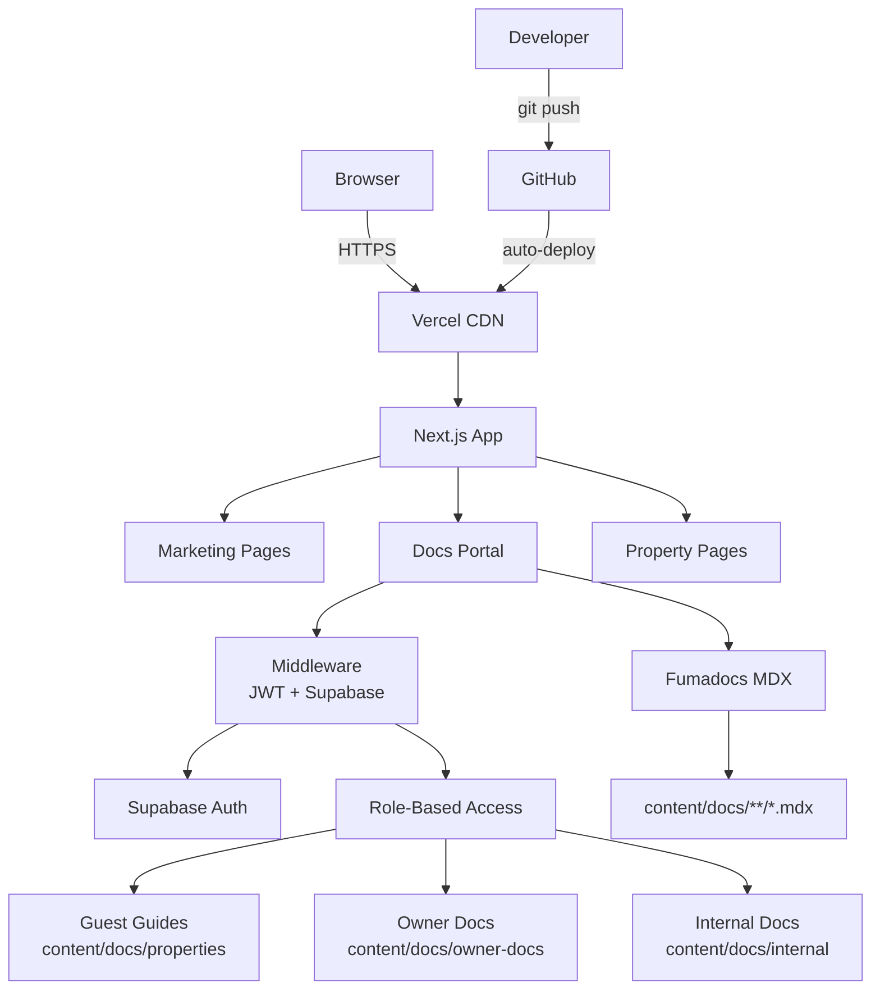

# SnowbirdHQ Website

## Overview

Marketing website and documentation portal for SnowbirdHQ, a luxury short-term rental property management company in Queenstown, New Zealand. Serves three audiences: public visitors (marketing pages), guests (property guides via tokenised links), and owners/staff (authenticated docs portal).

- **Production**: https://snowbirdhq.com
- **Docs portal**: https://docs.snowbirdhq.com
- **Repository**: https://github.com/andrewlaery/snowbirdhq-website

## Tech Stack

| Layer | Technology | Version |
|-------|-----------|---------|
| Framework | Next.js (App Router) | 16.1.1 |
| Language | TypeScript (strict) | 5.x |
| UI | React | 19.2.3 |
| Styling | Tailwind CSS | 3.4.14 |
| Docs engine | Fumadocs (MDX) | 14.x |
| Animation | Framer Motion | 12.x |
| Auth | Supabase Auth (magic link) | 2.97.0 |
| Guest tokens | jose (JWT) | 6.x |
| Hosting | Vercel (auto-deploy from GitHub) | - |
| DNS | Vercel nameservers | - |

## Architecture



### Core Components

| Component | Path | Purpose |
|-----------|------|---------|
| Root layout | `src/app/layout.tsx` | SEO metadata, Google Fonts (Inter, Cormorant Garamond), viewport |
| Homepage | `src/app/page.tsx` | Marketing landing: hero, property grid, about, contact |
| Property pages | `src/app/properties/[slug]/page.tsx` | Individual property detail with gallery |
| Docs layout | `src/app/docs/layout.tsx` | Fumadocs shell with RBAC-filtered sidebar |
| Docs home | `src/app/docs/page.tsx` | Section cards based on user role |
| Middleware | `src/middleware.ts` | Auth gate for `/docs/*` routes — Supabase session + guest JWT |
| Roles | `src/lib/auth/roles.ts` | RBAC engine: anonymous, guest, owner, staff |
| Page tree filter | `src/lib/auth/filter-page-tree.ts` | Filters Fumadocs sidebar by user access |
| Properties data | `src/data/properties.ts` | Property catalogue (16 properties with gallery config) |
| Search API | `src/app/api/search/route.ts` | Fumadocs simple search index |
| Auth callback | `src/app/auth/callback/route.ts` | Supabase OAuth code exchange |
| Guest token script | `scripts/generate-guest-token.ts` | CLI to generate time-limited guest access JWTs |

## Getting Started

```bash
# Install dependencies
npm install

# Copy env template and fill in values
cp .env.local.example .env.local

# Start dev server (Turbopack, port 3000)
npm run dev
```

Required environment variables (see `.env.local.example`):

| Variable | Purpose |
|----------|---------|
| `NEXT_PUBLIC_SUPABASE_URL` | Supabase project URL |
| `NEXT_PUBLIC_SUPABASE_ANON_KEY` | Supabase anonymous key |
| `RESEND_API_KEY` | Resend email service (contact forms) |
| `OWNER_EMAILS` | Comma-separated owner email allowlist |
| `STAFF_EMAILS` | Comma-separated staff email allowlist |
| `GUEST_TOKEN_SECRET` | HMAC secret for guest JWT signing |

## Commands Reference

| Command | Purpose |
|---------|---------|
| `npm run dev` | Dev server with Turbopack (port 3000) |
| `npm run build` | Production build |
| `npm run start` | Start production server locally |
| `npm run lint` | ESLint (`src/`) |
| `npm run type-check` | TypeScript strict check (`tsc --noEmit`) |
| `npx tsx scripts/generate-guest-token.ts --property <slug> --expires YYYY-MM-DD` | Generate guest access URL |
| `vercel --prod` | Manual production deployment |
| `vercel dns ls snowbirdhq.com` | List DNS records |

## Key Workflows

### Guest access

1. Generate a time-limited JWT: `npx tsx scripts/generate-guest-token.ts --property 25-dublin --expires 2026-03-15`
2. Script outputs a URL like `https://docs.snowbirdhq.com/docs/properties/25-dublin?token=<jwt>`
3. Middleware verifies the JWT, sets an httpOnly cookie, and redirects to the clean URL
4. Guest sees only their property's guides in the sidebar

### Owner/staff access

1. User visits `docs.snowbirdhq.com` and clicks Sign In
2. Supabase magic link sent to their email
3. After auth callback, middleware checks the email against `STAFF_EMAILS` / `OWNER_EMAILS` env vars
4. Sidebar is filtered to show only sections their role permits

### Deployment

1. Push to `main` branch on GitHub
2. Vercel automatically builds and deploys to production
3. Feature branches create preview deployments
4. Pre-deploy checks: `npm run build && npm run lint && npm run type-check`

### Content updates (docs)

1. Add/edit MDX files in `content/docs/` (properties, owner-docs, or internal)
2. Fumadocs auto-generates the page tree from the file structure and `meta.json` files
3. Custom MDX components available via `mdx-components.tsx` (e.g. `PropertyQuickInfo`)

## Project Structure

```
snowbirdhq/
├── src/
│   ├── app/
│   │   ├── layout.tsx              # Root layout (SEO, fonts)
│   │   ├── page.tsx                # Marketing homepage
│   │   ├── globals.css             # Tailwind base + utilities
│   │   ├── icon.tsx                # Dynamic favicon (Edge Runtime)
│   │   ├── not-found.tsx           # Custom 404
│   │   ├── api/search/route.ts     # Fumadocs search API
│   │   ├── auth/                   # Supabase auth flow
│   │   │   ├── signin/page.tsx
│   │   │   ├── callback/route.ts
│   │   │   └── access-denied/page.tsx
│   │   ├── docs/                   # Docs portal (Fumadocs)
│   │   │   ├── layout.tsx          # Docs shell with RBAC sidebar
│   │   │   ├── page.tsx            # Docs home (role-based sections)
│   │   │   └── [...slug]/page.tsx  # Dynamic MDX page renderer
│   │   ├── properties/[slug]/      # Public property detail pages
│   │   ├── privacy-policy/         # Legal
│   │   ├── terms/                  # Legal
│   │   └── guestmessage/           # Legacy guest welcome pages
│   ├── components/                 # Shared React components
│   ├── data/properties.ts          # Property catalogue
│   ├── lib/
│   │   ├── auth/roles.ts           # RBAC: resolveUserAccess, canAccessPath
│   │   ├── auth/filter-page-tree.ts
│   │   ├── source.ts               # Fumadocs loader
│   │   └── supabase/               # Supabase client (server + browser)
│   └── middleware.ts               # Auth gate for /docs/*
├── content/docs/                   # MDX documentation content
│   ├── properties/                 # Guest guides (16 properties)
│   ├── owner-docs/                 # Owner financial reports, agreements
│   └── internal/                   # Staff-only operations docs
├── public/                         # Static assets (logos, property images)
├── scripts/                        # CLI utilities
│   ├── generate-guest-token.ts     # Guest JWT generator
│   ├── sync-from-obsidian.sh       # Content sync from Obsidian vault
│   └── sync-to-obsidian.sh         # Content sync to Obsidian vault
├── plans/                          # Architecture decision docs
├── next.config.mjs                 # Security headers, MDX, docs subdomain rewrite
├── tailwind.config.js              # Brand colours, fonts, custom spacing
├── source.config.ts                # Fumadocs MDX config
└── mdx-components.tsx              # Custom MDX component registry
```

## Configuration

### Tailwind brand tokens

```js
colors: {
  snowbird: {
    blue: '#B5D3D7',
    'blue-dark': '#9BC5CA',
  }
}
fontFamily: {
  serif: ['Cormorant Garamond', ...],
  sans: ['Inter', ...]
}
```

### Security headers (next.config.mjs)

| Header | Value |
|--------|-------|
| X-Frame-Options | SAMEORIGIN |
| X-Content-Type-Options | nosniff |
| Referrer-Policy | origin-when-cross-origin |

### Docs subdomain rewrite

Requests to `docs.snowbirdhq.com/:path` are rewritten to `/docs/:path` via Next.js `rewrites()` in `next.config.mjs`, allowing the docs portal to live on a subdomain without a separate deployment.

### RBAC model

| Role | Guest Guides | Owner Docs | Internal |
|------|-------------|------------|----------|
| Anonymous | - | - | - |
| Guest (JWT) | Own property only | - | - |
| Owner (Supabase) | Scoped properties | Scoped properties | - |
| Staff (Supabase) | All | All | All |

## Access Management

### Roles summary

| Role | How they get access | What they see |
|------|-------------------|---------------|
| Staff | Email in `STAFF_EMAILS` + magic link sign-in | Everything |
| Owner | Email in `OWNER_PROPERTIES` + magic link sign-in | Owner docs + guest guides for their assigned properties |
| Guest | Tokenised URL (no sign-in needed) | Single property's guest guide |

### Adding/removing staff or owners

1. Open the [Vercel dashboard](https://vercel.com) → **snowbirdhq** project → **Settings** → **Environment Variables**
2. Edit the relevant variable:

| Variable | Format | Example |
|----------|--------|---------|
| `STAFF_EMAILS` | Comma-separated emails | `alice@bcampx.com,bob@bcampx.com` |
| `OWNER_PROPERTIES` | `email:slug1,slug2;email2:slug3` | `owner@gmail.com:25-dublin,7-suburb;jane@example.com:1-34-shotover` |
| `OWNER_EMAILS` | Comma-separated emails | `owner@gmail.com,jane@example.com` |

> **Note**: `OWNER_EMAILS` grants the owner role but no property access on its own. Property access requires a matching entry in `OWNER_PROPERTIES`.

3. Save, then redeploy: **Deployments** → latest → three dots → **Redeploy**

**Via CLI**:
```bash
# Remove old value and add new one
vercel env rm STAFF_EMAILS production
vercel env add STAFF_EMAILS production
# paste new value when prompted, then redeploy:
vercel --prod
```

### Generating guest access links

```bash
# Requires GUEST_TOKEN_SECRET in your environment
# Pull from Vercel if needed: vercel env pull .env.local

npx tsx scripts/generate-guest-token.ts \
  --property 25-dublin \
  --expires 2026-03-31
```

Outputs a URL like:
```
https://docs.snowbirdhq.com/docs/properties/25-dublin?token=<jwt>
```

Send this to the guest. The token is valid until the `--expires` date (23:59:59 UTC). After expiry, generate a new one.

### Viewing registered users

All emails that have attempted sign-in are recorded in Supabase. View them at: **Supabase dashboard** → **Authentication** → **Users**.

### Email sending (SMTP)

Magic link emails are sent via Resend custom SMTP. Configuration:
- **Supabase**: Authentication → Email → SMTP Settings
- **Resend**: Domain `snowbirdhq.com` verified, DNS records on Vercel
- **Sender**: `noreply@snowbirdhq.com`

If emails stop sending, check:
1. Resend API key is still valid (resend.com → API Keys)
2. Domain is still verified (resend.com → Domains)
3. SMTP settings in Supabase are correct (host: `smtp.resend.com`, port: `465`, username: `resend`, password: Resend API key)

## Testing & Deployment

**No automated test suite.** Quality is enforced via:
- TypeScript strict mode
- ESLint (zero warnings policy)
- Vercel preview deployments on feature branches

**Deployment**: Automatic via GitHub push to `main`. Vercel handles build, CDN distribution, and edge functions.

**Pre-deploy checklist**:
```bash
npm run build
npm run lint
npm run type-check
```

## Related Documentation

| Document | Location |
|----------|----------|
| Project-specific Claude instructions | `CLAUDE.md` |
| Ecosystem context | `_ECOSYSTEM.md` |
| RBAC design plan | `plans/rbac-docs-portal.md` |
| Website redesign plan | `plans/website-redesign.md` |
| Workspace ecosystem map | `../__Production/CLAUDE.md` |
| Property registry (canonical) | `../_shared/property_registry.json` |
